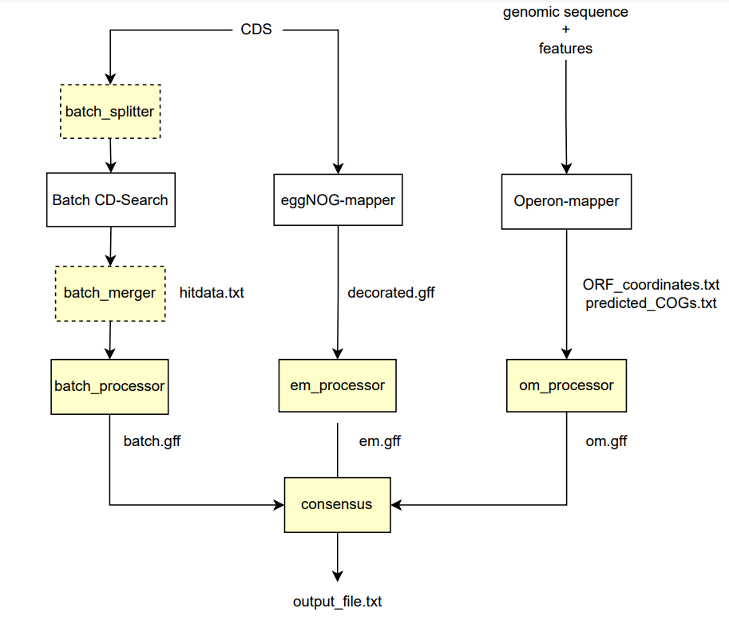
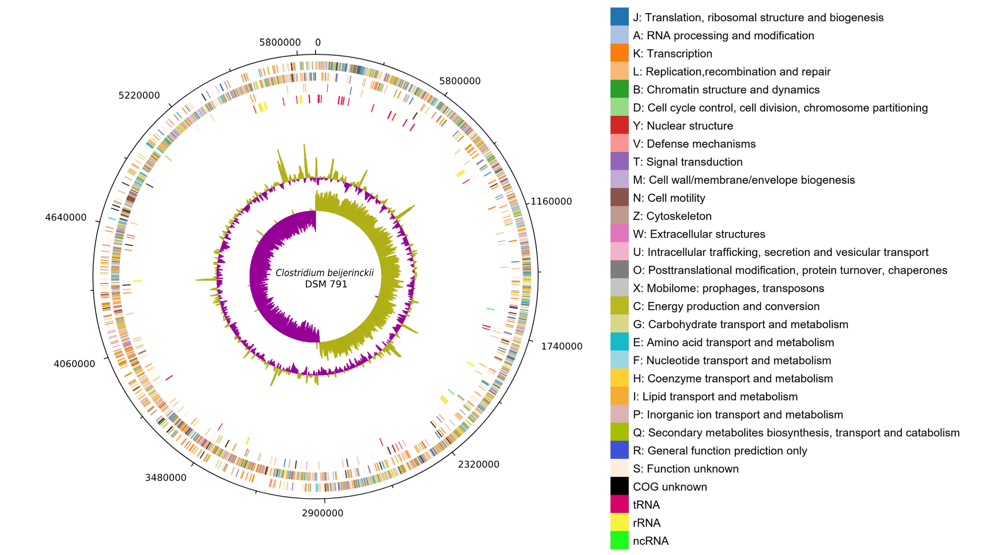

# the COG-or

## Introduction
Package for improving the functional annotation of bacterial genomes, classification of protein-coding sequences into clusters of orthologous groups, and visualization 
of the final annotated genome. The package uses the outputs of the tools that assign COG to protein
coding sequences, namely eggNOG-mapper, Operon-mapper,and Batch CD-Search. The COG-or includes functions to 
process these outputs and improve the annotation. It outputs a new processed file in a suitable format 
that is ready to be visualized in DNAPlotter program. 

The tools for a genome annotation are available at:

eggNOG-mapper: http://eggnog-mapper.embl.de/ 

Operon-mapper: https://biocomputo.ibt.unam.mx/operon_mapper/

Batch CD-Search: https://www.ncbi.nlm.nih.gov/Structure/bwrpsb/bwrpsb.cgi

## Installation 
Installers for the latest released version are available at the Python Package Index (PyPI):

```
pip install COGor
```

## Usage

The COG-or package includes functions shown in the diagram below (yellow blocks). You can run the whole process with:
```
py cogor.py -n organism_name -i input_path -o output_path -t
```

When using COG-or via the command line, please keep in mind that the files have to be named as follows:

- organism_name_eggnog.gff
- organism_name_cds.txt
- organism_name_orf_operon.txt
- organism_name_cog_operon.txt
- organism_name_batch.txt
- organism_name.fasta
- organism_name.gff3



Or the functions can be called individually as follows:

### PROGRAM PROCESSING

```
batch_splitter(organism_name,CDS_file)
batch_merger(organism_name,file1,file2)
batch_processor(organism_name,batch_file)
em_processor(organism_name, eggNOGmapper_file, CDS_file)
om_processor(organism_name, Operon_ORF_file, Operon_COG_file)
```

### ANNOTATION IMPROVEMENT
```
consensus(om_file,em_file,batch_file,fasta_file, get_pseudo=True, get_ncrna=True, gff_file)
```

### VISUALIZATION
```
get_track_template()
get_legend()
```

After uploading the required file to DNAPlotter, you can obtain similar image as the one shown as an example below.



## Documentation

For the full documentation and tutorial please see the COG-or documentation.